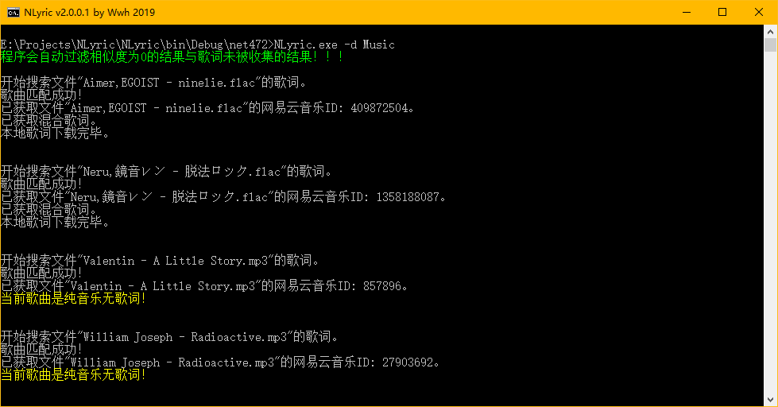
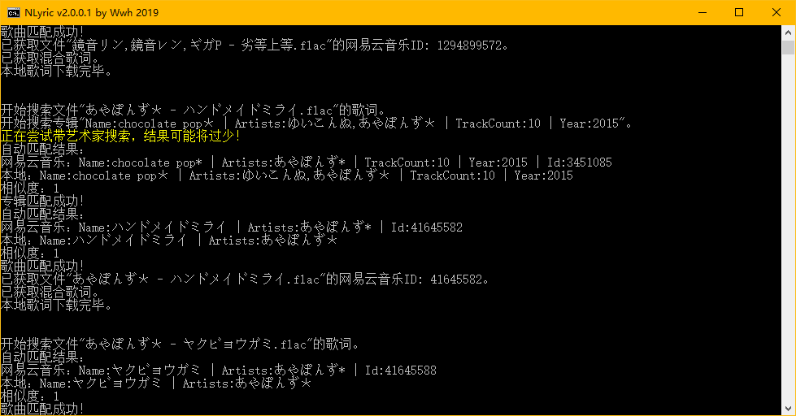
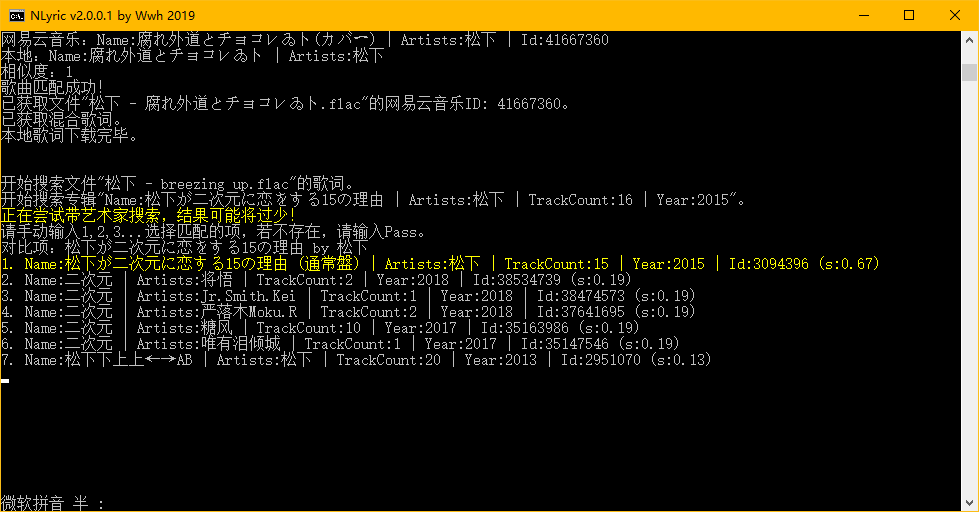
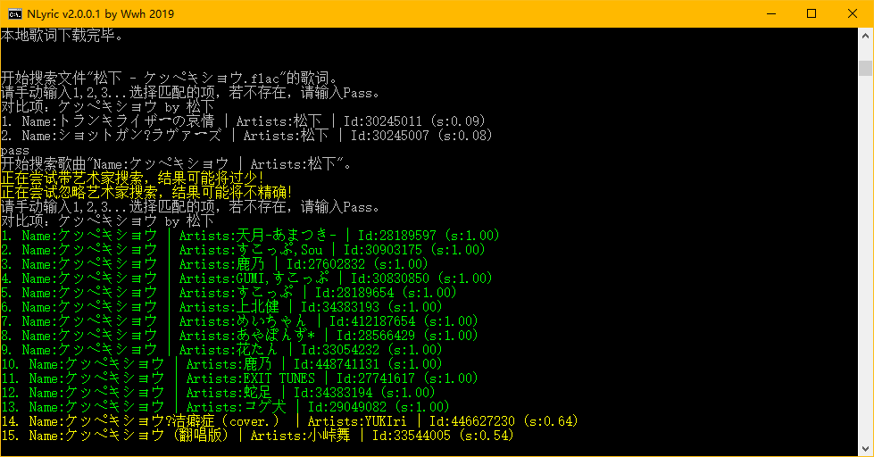
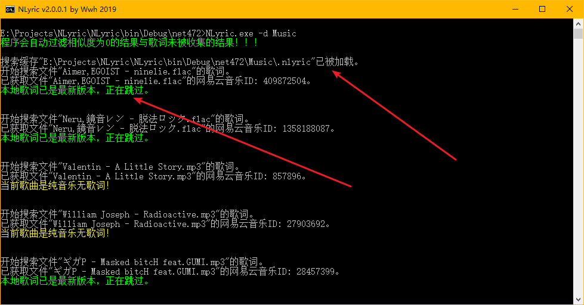
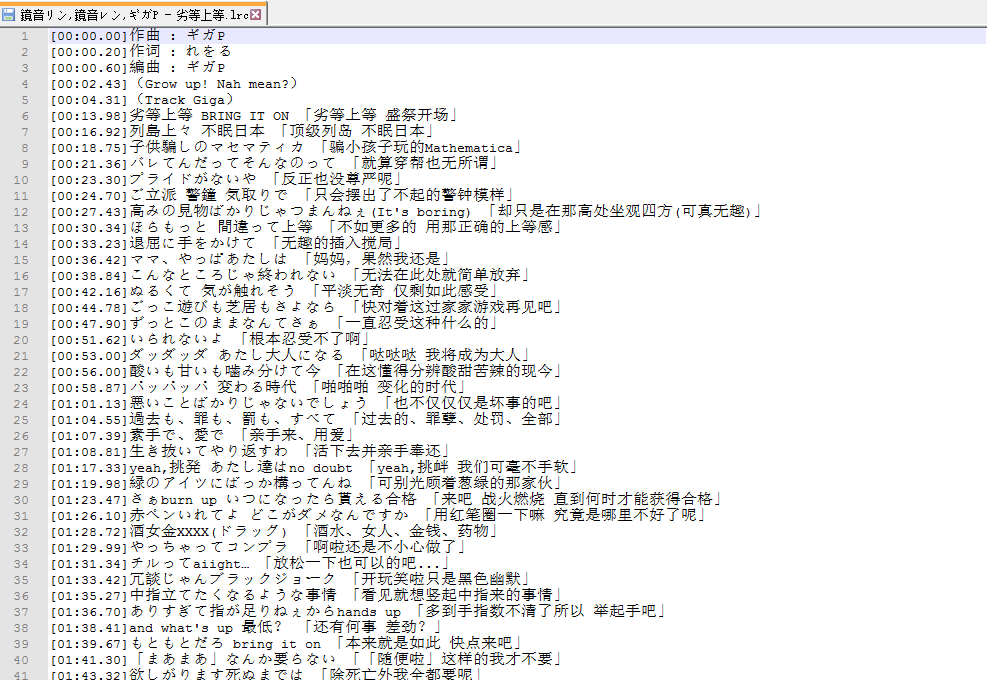

# NLyric

网易云音乐歌词自动搜索下载


首次运行，无需配置直接使用。


自动匹配专辑。


在非完全精确匹配到的情况下，提供用户选项，并且按照匹配程度排序并高亮显示。


自动尝试多种搜索方式，尽可能匹配到有效歌词。


再次运行时，自动加载缓存文件，导入以往匹配成功结果，自动判断本地歌词是否需要更新（比如网易云音乐上歌词更新了翻译，NLyric可以检测到）。


提供歌词混合模式，同时显示原始歌词与翻译歌词。

## 使用方式

1. 下载压缩包（下载地址在下面），全部解压。

2. 进入解压后的文件夹（内有NLyric.exe等文件），在文件夹内按住Shift，鼠标单击右键，选"在此处打开命令窗口"

3. 输入命令"NLyric.exe -d *音乐文件夹*"

4. 按照程序提示完成接下来的步骤

## 配置

配置文件是"Settings.json"，自己修改即可

默认配置：

``` json
{ // 所有匹配都是忽略大小写的！！！
	"Search": { // 搜索设置，在每一次搜索生效
		"AudioExtensions": [
			".aac",
			".ape",
			".flac",
			".m4a",
			".mp3",
			".ogg",
			".wav",
			".wma"
		], // 会被识别为歌曲的扩展名
		"Separators": "|;,/\\&:", // 分隔符，用于分割歌手名
		"WholeWordReplace": {
			"sh0ut": "shØut",
			"あやぽんず＊": "あやぽんず*"
		}, // 前面是被替换的词，后面是要替换成的词，比如歌名"sh0ut"，搜索的时候会被替换成"shØut"来搜索，网易云音乐部分歌曲歌手名收录有问题，只能这么办
		"Limit": 15 // 搜索结果数量
	},
	"Fuzzy": { // 第一次搜不到或者匹配失败的情况下，是否进行模糊搜索与匹配
		"TryIgnoringArtists": true, // 忽略艺术家
		"TryIgnoringExtraInfo": true, // 忽略 括号/空格 + Cover/feat. 之后的内容，支持的括号类型在Filter.OpenBrackets里
		"ExtraInfoStart": " ([{【〖", // 空格和左括号等之后的内容会被过滤，注意，不要随便修改这里的内容，可能导致过滤准确性降低
		"Covers": [
			"Cover",
			"カバー"
		], // Cover的各种写法
		"Featurings": [
			"feat.",
			"ft."
		] // Feat.的各种写法
	},
	"Match": { // 匹配设置，在搜索到歌曲信息之后，程序会通过自己的算法再次确认是否匹配
		"MinimumSimilarity": 0.9, // 最小相似度，0~1
		"CharReplace": {
			"\u00B7": "\u002e",
			"\u0387": "\u002e",
			"\u05BC": "\u002e",
			"\u2022": "\u002e",
			"\u2027": "\u002e",
			"\u2219": "\u002e",
			"\u22C5": "\u002e",
			"\u30FB": "\u002e",
			"\uFF65": "\u002e",
			// · -> .
			"\uFF0A": "\u002A",
			// *
			"\uFF01": "\u0021",
			// !
			"\uFF1A": "\u003A",
			// :
			"\u005B": "\u0028",
			"\u007B": "\u0028",
			"\u3010": "\u0028",
			"\u3016": "\u0028",
			// (
			"\u005D": "\u0029",
			"\u007D": "\u0029",
			"\u3011": "\u0029",
			"\u3017": "\u0029"
			// )
		} // 前面是被替换的字符，后面是要替换成的字符，只支持单个字符替换，意思就是一个文字，多个文字会报错
	},
	"Lyric": {
		"Modes": [
			"Merged",
			"Raw",
			"Translated"
		], // 歌词模式，依次尝试每一个模式直到成功，Merged表示混合未翻译和翻译后歌词，Raw表示未翻译的歌词，Translated表示翻译后的歌词
		"AutoUpdate": true, // 是否自动更新由NLyric创建的歌词
		"Overwriting": false // 是否覆盖非NLyric创建的歌词
	}
}
```

## 下载

GitHub: [.NET Framework版（Windows请下载这个）](https://github.com/wwh1004/NLyric/releases/latest/download/NLyric-net472.zip) [.NET Core版](https://github.com/wwh1004/NLyric/releases/latest/download/NLyric-net472.zip)

AppVeyor: [](https://ci.appveyor.com/project/wwh1004/nlyric/branch/master)

## 感谢

混合歌词的思路参考了 [EHfive/Some-js-script-for-FB2](https://github.com/EHfive/Some-js-script-for-FB2K)
